# RefConnect

A specialized Android platform that connects job seekers with quality referral opportunities through **MCQ-based screening generated from recruiter-defined tech stacks**.

---

## Project Overview

RefConnect addresses a critical gap in the referral ecosystem. Traditional referral systems are plagued by spam applications, unqualified candidates, and low signal-to-noise ratios that waste time for both referrers and seekers. RefConnect solves this by introducing a **gated, test-based screening mechanism** that ensures only serious and qualified candidates can request referrals.

Unlike generic networking platforms, RefConnect is purpose-built exclusively for referral scenarios. The platform enforces a structured flow where seekers must demonstrate their qualifications through **mandatory MCQ-based screening tests generated from the recruiter-defined technology stack** before initiating referral requests. This approach improves quality, reduces spam, and creates a more efficient and trustworthy referral process.

---

## Problem Statement

### Current Challenges in Referral Systems
- High volume of unqualified or spam referral requests
- Referrers overwhelmed by low-quality applications
- No verification of candidate seriousness before requesting referrals
- Lack of structured screening before referral initiation
- Time wasted reviewing unsuitable candidates

### RefConnect Solution
RefConnect introduces a **gated referral workflow** where seekers must complete **MCQ-based screening tests derived from the tech stack specified by the recruiter**. Only candidates who pass the screening are allowed to request referrals, ensuring quality and intent at every step.

---

## Implemented Features

### Authentication & User Management
- User registration and login
- Persistent login sessions across app restarts
- Role-based user flows (Seeker / Recruiter)
- Secure session handling

---

### Referral-Focused Core Workflow
- Dedicated referral opportunity discovery for seekers
- Structured referral request flow with gated access
- Clear separation between browsing opportunities and requesting referrals
- Role-based navigation for seeker and recruiter journeys

---

### Tech-Stack Based Screening System (MCQ)
- Mandatory MCQ-based screening before referral requests
- Screening questions generated from the **recruiter-defined tech stack**
- Role-specific and technology-focused MCQs
- Automatic scoring and eligibility determination (pass/fail)
- Objective evaluation to filter serious and qualified candidates

---

### Quality Control Mechanisms
- Screening completion required before referral requests
- Controlled flow to prevent spam and low-quality applications
- Clear eligibility checkpoints before referral submission
- Transparent screening outcomes for both seeker and recruiter

---

### Recruiter Capabilities
- Create referral opportunities with role, experience, location, and tech stack
- View applicants who have completed screening
- Review candidate profiles and screening results
- Manage referral opportunities and applicant flow

---

### Technical Foundation
- Modern UI built with Jetpack Compose
- Material Design 3 for consistent user experience
- MVVM architecture for clean separation of concerns
- Room Database for local data persistence
- Robust state management to handle configuration changes

---

## App Flow

### Seeker Journey (Primary Use Case)

1. **Onboarding** – User signs up and logs in
2. **Role Selection** – User selects Seeker role
3. **Referral Discovery** – Browse available referral opportunities
4. **Referral Details** – View role requirements and tech stack
5. **Screening Test** – Complete MCQ-based test generated from the recruiter’s tech stack
6. **Evaluation** – System automatically scores responses
7. **Eligibility Unlock** – Only qualified candidates can proceed
8. **Referral Request** – Submit referral request for recruiter review

---

### Recruiter Journey

1. **Login & Role Selection** – Recruiter signs in
2. **Create Opportunity** – Define role, experience, location, and tech stack
3. **View Applicants** – See candidates who passed screening
4. **Evaluate Results** – Review screening scores and profiles
5. **Proceed with Referral** – Decide next steps

---

## Technical Architecture

- **Authentication Layer** – Session management using DataStore
- **Screening Engine** – Generates MCQ-based questions from recruiter-defined tech stacks and evaluates responses automatically
- **Repository Pattern** – Abstracts local data sources (Room Database)
- **ViewModel Layer** – Handles business logic, screening flow, and UI state
- **Compose UI** – Declarative UI that reacts to state changes
- **Local Persistence** – Stores users, opportunities, test attempts, and results

---

## Screenshots

### Authentication & Onboarding
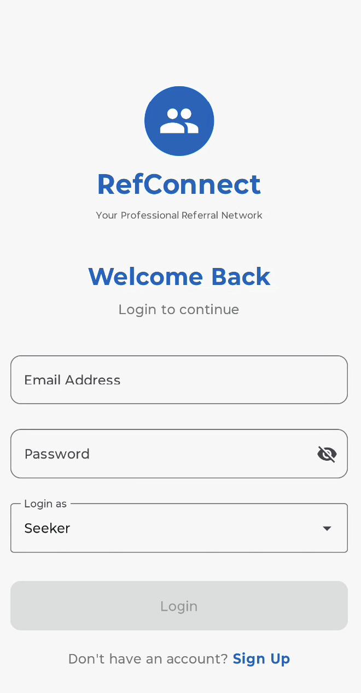  
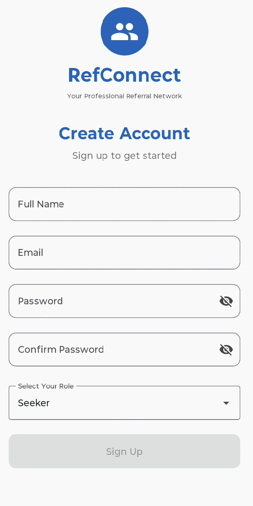  
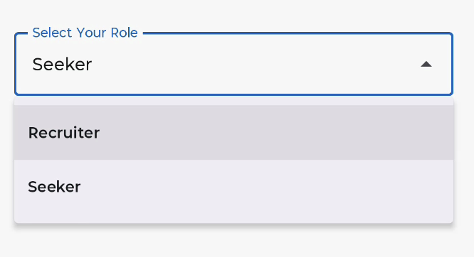

### Referral Flow (Seeker)
  
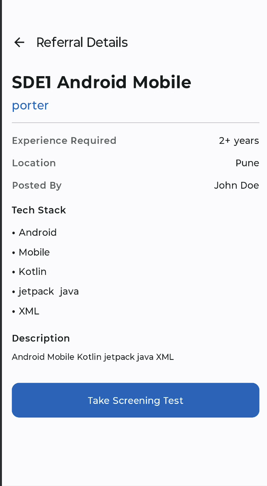  
  
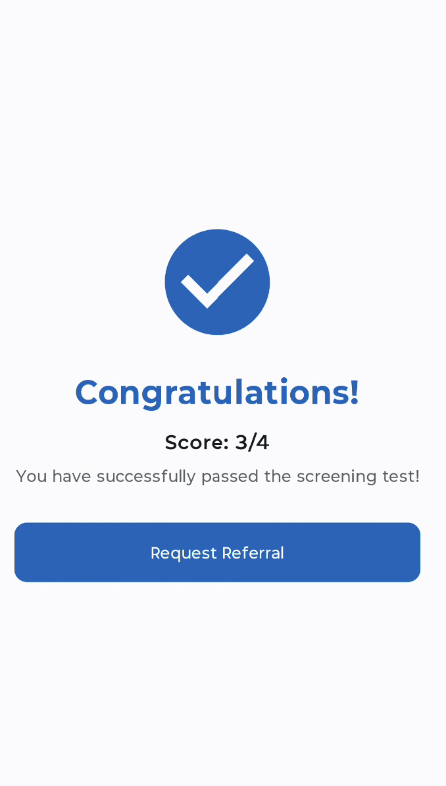  
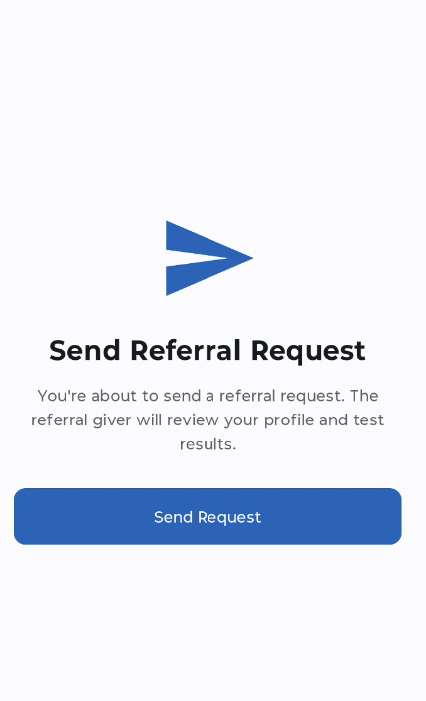

### Recruiter Flow
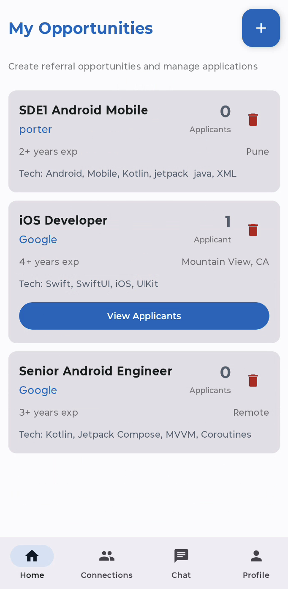  
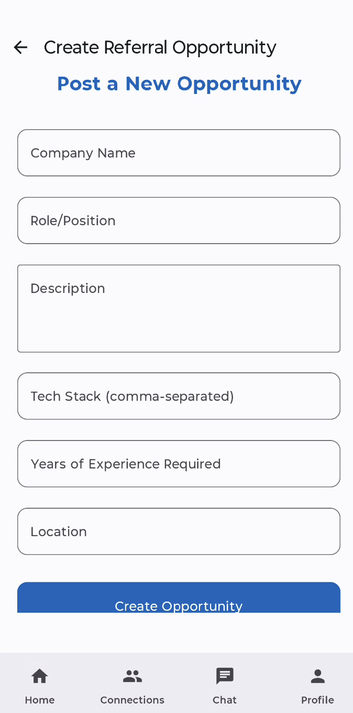  
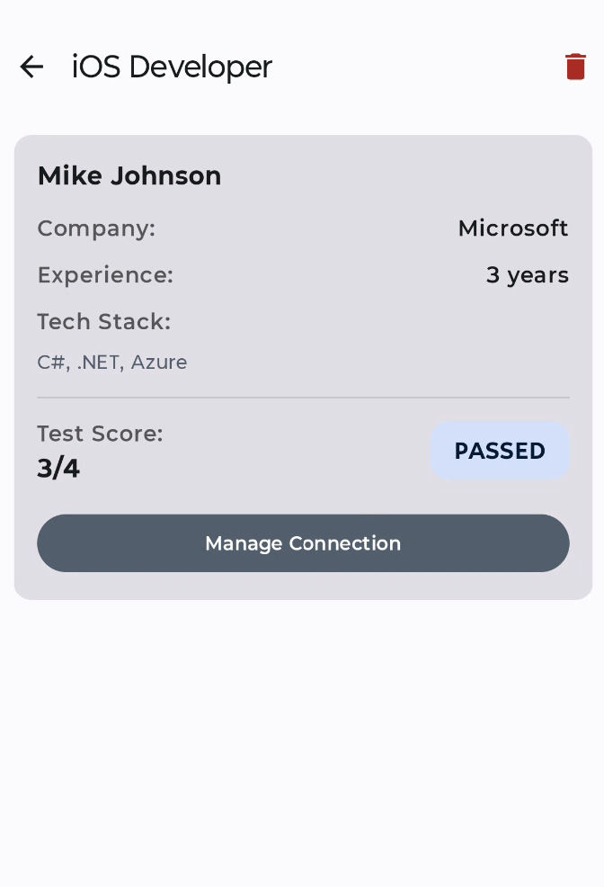

### Supporting Screens
  
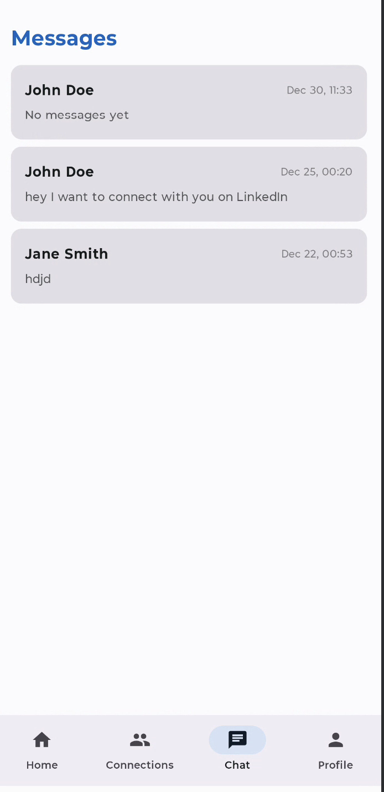  
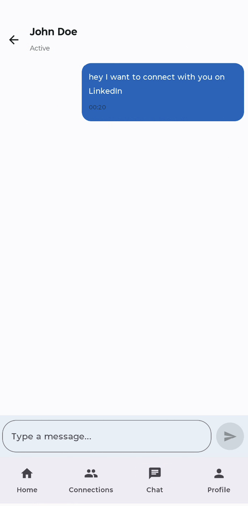  
  
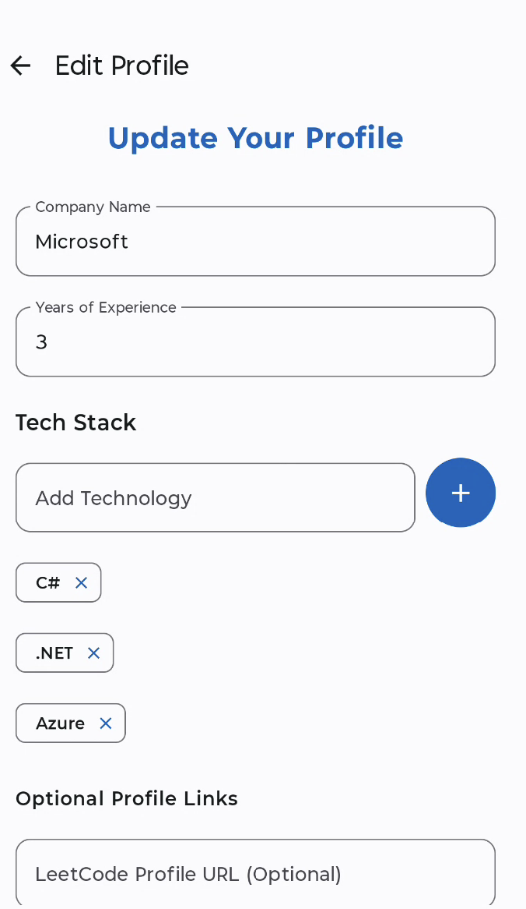  


---

## APK Download

You can download and install the RefConnect APK from the link below:

🔗 **APK Download:**  
https://your-apk-link-here

> Note: Enable **“Install from unknown sources”** on your Android device before installing the APK.

---

## Tech Stack

### Core Technologies
- **Kotlin**
- **Jetpack Compose**
- **Material Design 3**

### Architecture & Libraries
- **MVVM Architecture**
- **Room Database**
- **DataStore**
- **Coroutines & Flow**
- **Navigation Compose**

### Screening Logic
- MCQ-based question generation from recruiter-defined tech stacks
- Automatic scoring and eligibility checks

### Development Tools
- Android Studio
- Gradle
- Git & GitHub

---

## Setup & Run Instructions

### Prerequisites
- Android Studio Ladybug or later
- JDK 11+
- Android SDK (API 24+)
- Git

### Installation

```bash
git clone https://github.com/yourusername/RefConnect.git
cd RefConnect


Referral-focused Android app built with Kotlin and Jetpack Compose that uses MCQ-based screening from recruiter-defined tech stacks to ensure high-quality referral requests.